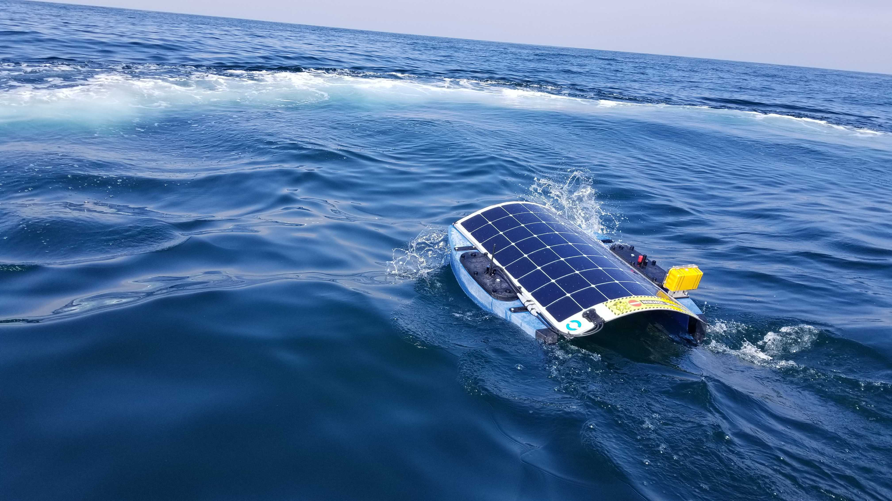

# SolarSurfer2

Code used to create SolarSurfer2 (SolarTurtle) package for BlueOS.

This repository was a two weeks hackathon to create an autonomous solar vessel that would travel between Los Angeles and Hawaii.

